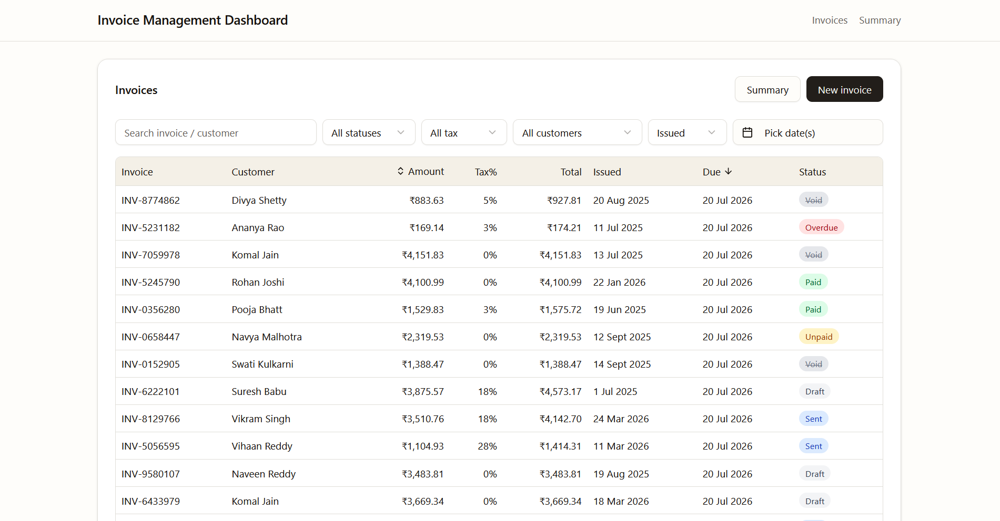
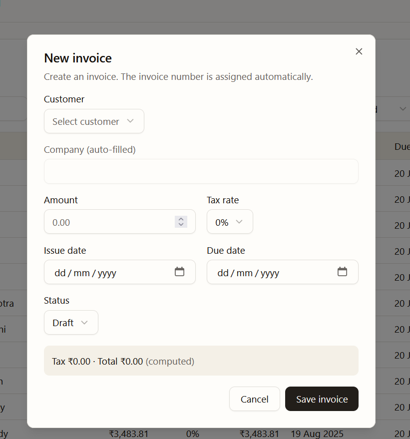
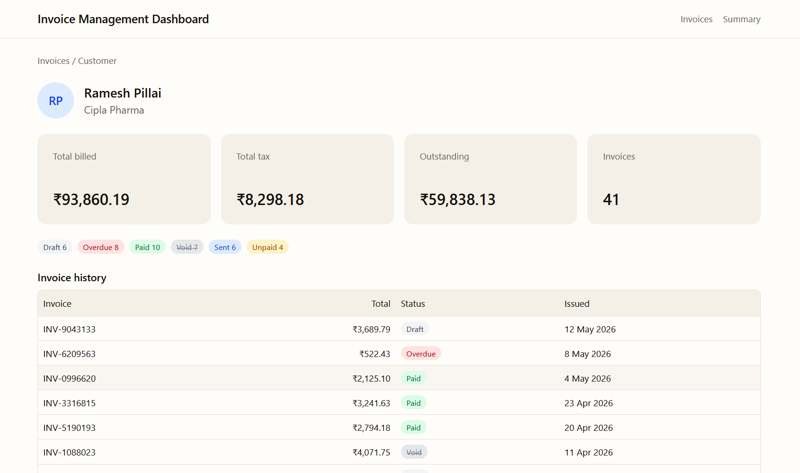
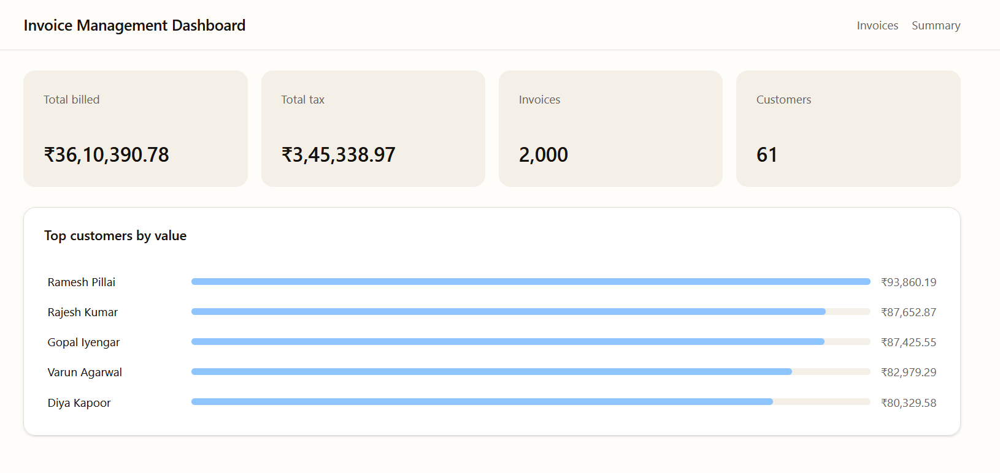

# Invoice Management Dashboard

A full-stack invoice management dashboard: a paginated, sortable, filterable invoice table
with create/edit forms, a customer profile view, and a summary/analytics view — backed by a
performant API over a seeded dataset of **2,000 invoices across 61 customers**.

## Screenshots

| Invoice list (sort · filter · paginate) | Create / edit invoice |
|---|---|
|  |  |

| Customer profile (metrics · history) | Summary / analytics |
|---|---|
|  |  |

## Tech Stack

| Layer | Choice |
|---|---|
| Frontend | React 19 + TypeScript, Vite, React Router, TanStack Query, react-hook-form + Zod, shadcn/ui (Tailwind v4) |
| Backend | Node + Express + TypeScript, Mongoose |
| Database | MongoDB |
| Shared | A `@invoice/shared` package — Zod schemas + types used by **both** frontend and backend |
| Tooling | pnpm workspaces (monorepo), Docker Compose, Vitest |

## Monorepo Layout

```
invoice-platform/
├── apps/
│   ├── backend/        Express API (layered: routes → controllers → services → models)
│   └── frontend/       React app (Vite)
├── packages/
│   └── shared/         Zod schemas, enums, and shared TypeScript types (the API contract)
├── seed-data.json      2,000 source invoice records
└── docker-compose.yml  Mongo + API + Frontend
```

**Why a monorepo with a shared package:** the API contract (invoice/customer shapes, the
create/query Zod schemas, the status & tax-rate enums) lives in `packages/shared` and is
imported by both sides. The backend validates requests with the same Zod schema the frontend
builds its form resolver from, so the two can never silently drift.

## Prerequisites

- **Node ≥ 20** and **pnpm** (`npm i -g pnpm`)
- **Docker** (for MongoDB; or a local Mongo on `:27017`)

## Setup & Run (local dev)

```bash
# 1. Install all workspaces
pnpm install

# 2. Start MongoDB (Docker)
docker compose up -d mongo

# 3. Configure the backend
cp apps/backend/.env.example apps/backend/.env      # MONGODB_URI + PORT=5050

# 4. Seed the database (idempotent — safe to re-run)
pnpm --filter @invoice/backend seed

# 5. Run the API (http://localhost:5050)
pnpm --filter @invoice/backend dev

# 6. Run the frontend (http://localhost:5173) — in a second terminal
pnpm --filter @invoice/frontend dev
```

The frontend dev server proxies `/api/*` to the backend on `:5050`, so there are no CORS
concerns and no hardcoded API URL in the client.

## Setup & Run (Docker — full stack)

Bring up Mongo + API + Frontend together:

```bash
docker compose up --build           # frontend on http://localhost:8080, API on :5050
docker compose run --rm api pnpm --filter @invoice/backend seed   # seed once
```

## Running the Seed Script

```bash
pnpm --filter @invoice/backend seed
```

The source `seed-data.json` is **flat and denormalised** (each record carries the customer
name + company as strings and dates as ISO strings). The seed script normalises it into the
two-collection model:

1. Derive the **61 unique customers** from distinct `(customer, company)` pairs and upsert them.
2. Build a `name|company → _id` lookup from the persisted customers.
3. Rewrite each invoice's `customer` string into the Customer `ObjectId` ref and parse the
   ISO date strings into real `Date` objects.
4. Upsert the **2,000 invoices** keyed on `invoiceId`.

It is **idempotent** — every write is an upsert (customers on `(name, company)`, invoices on
`invoiceId`), so re-running produces the same database state with no duplicates. It logs
progress (`upserted 61 unique customers`, `invoices — inserted N, updated M`).

## Data Modeling Rationale

### Two collections: `customers` and `invoices` (pure reference)

Each customer maps 1:1 to a company. Keeping `Customer` as its own collection means company
identity lives in **one** place — a name change is a single write, not a bulk update across
hundreds of invoices. The invoice references the customer by `ObjectId` only; **company is not
denormalised onto the invoice**. The list view's join is cheap because `$lookup` runs *after*
`$skip`/`$limit` (so it only touches the current page), which makes denormalisation an
unnecessary trade of write-anomaly risk for a join that's already small.

### Reference vs. denormalisation — three options considered

The invoice *could* have stored `customerName`/`company` directly to avoid a join. Three
approaches were on the table:

| Approach | Read (list) | Write (rename a customer) | Verdict |
|---|---|---|---|
| **A.** Single collection, everything flat on the invoice | no join | update the name in *every* invoice for that customer; grouping by a name string is fragile (casing/whitespace dupes) | ❌ write anomalies + fragile aggregation |
| **B.** Two collections, but denormalise name/company onto the invoice | no join | update `Customer` **and** bulk-update every invoice it owns; inconsistency window between the two writes | ❌ anomaly for a join that's already cheap |
| **C.** Two collections, pure reference *(chosen)* | join — but only on the current page | one write | ✅ |

Why B's "avoid the join" reasoning doesn't hold: in the aggregation pipeline the `$lookup`
runs **after** `$skip`/`$limit`, so only the ~20 rows on the current page are ever joined. The
join cost is fixed at *page size*, not result-set size — so denormalising buys almost nothing
while taking on real write-anomaly risk.

### `$lookup` vs `.populate()`

Both attach the customer to an invoice; they differ in control:

- **`.populate()`** (Mongoose) runs a second query after the main `find`. Simplest, and it's
  what we use for **single-document** reads (`GET /invoices/:id`) where there's nothing to
  paginate.
- **`$lookup`** inside an **aggregation pipeline** lets us order stages explicitly:
  `$match → $sort → $skip → $limit → $lookup`. For the **list view** this guarantees the join
  happens *after* pagination, and `$facet` returns the page rows **and** the total count in a
  single round trip. That ordering control is exactly why the list endpoint uses aggregation
  rather than populate.

> Gotcha worth noting: aggregation `$match` does **not** apply Mongoose's automatic
> `string → ObjectId` casting the way `find()` does. The `customer` filter is therefore cast
> explicitly (`new Types.ObjectId(id)`) before it reaches the pipeline — otherwise a string id
> silently matches nothing.

### Scaling the read path

Today's design handles 2,000 records comfortably. If the data grew by orders of magnitude, the
escalation path is:

1. **Indexes + offset pagination (current).** Fine into the low hundreds of thousands — every
   filter/sort path is indexed and the join is page-bounded.
2. **Cursor (keyset) pagination.** At deep offsets `$skip` still scans the skipped documents.
   Switch to a cursor on the sort key (e.g. `dueDate` + `_id`) for constant-time page steps on
   large, append-heavy datasets.
3. **Offload search & rollups.** The `search` regex is a collection scan — move free-text to a
   MongoDB **text index** or **Atlas Search**, and precompute the summary / top-customers
   rollups (materialised view or scheduled aggregation) instead of computing them per request.

### Field types

- `issueDate` / `dueDate` stored as **`Date`** (not strings) — string range queries are
  lexicographic, not chronological, and break across year boundaries.
- `taxRate` is a `Number` validated against the enum `[0, 3, 5, 18, 28]`.
- `status` validated against the enum at the schema layer.
- `tax` / `total` are **stored as issued** (not recomputed at read time) — see Assumptions.
- `invoiceId` is `unique` and **server-generated** via an atomic counter — see Assumptions.

### Indexes (Invoice)

Each index maps to a specific API filter/sort path — none are speculative:

| Index | Serves |
|---|---|
| `invoiceId` (unique) | seed upsert idempotency + GET by id |
| `status` | status filter |
| `customer` | customer filter + profile `$match` |
| `dueDate` | sort + range filter |
| `issueDate` | range filter |
| `amount` | sort |
| `taxRate` | tax-rate filter |
| `(customer, status)` compound | customer profile view (filters by both) |

`Customer._id` is indexed by default, so the profile/list `$lookup` against it needs no manual index.

## API Design

Base URL: `http://localhost:5050` (proxied as `/api` from the frontend).

| Method & Path | Description |
|---|---|
| `GET /invoices` | Paginated, sortable, filterable invoice list |
| `GET /invoices/:id` | Single invoice (customer populated) |
| `POST /invoices` | Create an invoice (`invoiceId`, `tax`, `total` assigned server-side) |
| `PATCH /invoices/:id` | Partial update (merge) |
| `GET /customers` | All customers `{ _id, name, company }` (filter dropdown) |
| `GET /customers/:id` | Customer profile: metrics, status counts, full invoice history |
| `GET /summary` | Global rollup: totals, counts, top-5 customers by value |
| `GET /health` | Liveness check |

**`GET /invoices` query params:** `page` (default 1), `limit` (default 20, max 100),
`sortBy` (`amount` \| `dueDate`, default `dueDate`), `order` (`asc` \| `desc`, default `desc`),
`status`, `customer` (id), `taxRate`, `search` (matches invoiceId or customer name),
`issueDateFrom`, `issueDateTo`, `dueDateFrom`, `dueDateTo`. All are validated/coerced by a Zod
schema before reaching the service. Response shape: `{ data, page, limit, total, totalPages }`.

### Architecture decisions

- **Layered backend** (`routes → controllers → services → models`). Routes wire paths to
  validation + handlers; controllers do HTTP only; **all Mongoose lives in the service layer**
  (Dependency Inversion) so queries are reusable and the HTTP layer is DB-agnostic.
- **Express over Nest** — for an API this size, Express keeps the layering explicit and
  lightweight without Nest's decorator/module overhead.
- **Offset pagination** — at 2,000 records with server-side filtering/sorting, offset is
  simple and performant. Cursor pagination earns its complexity at millions of append-only
  rows; here it would add cost without benefit.
- **Aggregation `$facet`** on the list endpoint returns the page rows and the total count in a
  single round trip, with `$lookup` ordered after `$skip`/`$limit`.
- **Zod as the single source of truth** — request validation (backend) and the form resolver
  (frontend) use the same schemas from `@invoice/shared`.
- **Frontend**: TanStack Query for server state (caching, dedup, race-safety), filter/sort/page
  held in **URL params** (shareable, refresh-safe), `React.memo` rows + debounced search, and
  route/modal code-splitting to keep the initial bundle small on low-end devices.

### Why `PATCH /invoices/:id` and not `PUT`

Invoice edits are **partial modifications**, so the update endpoint is `PATCH`:

- The request body is optional-per-field and **merged** onto the existing document —
  omitted fields are left unchanged. That is PATCH semantics by definition. `PUT` would
  mean "replace the entire resource with this body", which would require resetting any
  omitted field.
- An invoice is a poor fit for full replacement: `invoiceId` is immutable, `tax`/`total`
  are derived server-side, and `createdAt`/`updatedAt` are managed by the DB. A verb
  whose contract is "send the complete resource" is dishonest when several fields are not
  client-owned.
- The update sets **absolute values** (e.g. `status = "Paid"`), never deltas, so it is
  idempotent regardless of the verb — idempotency is not the deciding factor here.

The verb reflects the **endpoint contract** (a partial change-set is accepted), not the
habits of any one client.

## Testing

Unit tests with **Vitest** across the workspace:

```bash
pnpm test                              # all packages
pnpm --filter @invoice/backend test    # one package
```

- **shared** — Zod contract: `createInvoiceSchema` (rejects bad tax rate/status, omits the
  server-owned `invoiceId`, coerces dates) and `invoiceQuerySchema` (defaults + coercion).
- **backend** — `round2` money rounding (incl. the `1.005 → 1.01` float edge) and
  `buildInvoiceQuery` (status/taxRate filters, the customer→ObjectId cast, the search `$or`,
  inclusive date ranges, sort).
- **frontend** — formatters and the `Pagination` component (range summary, page callbacks,
  disabled edges) via Testing Library + jsdom.

The query-builder and schema tests target the highest-risk logic (the exact spots where the
two real bugs were caught: the ObjectId cast and tax-rate validation).

## Assumptions

- **Metrics are status-scoped by accounting meaning, not raw sums.** The invoice
  statuses map to an accounts-receivable model:
  - **Total billed** = `Sent + Unpaid + Overdue + Paid` — issued, non-cancelled invoices.
  - **Outstanding** = `Sent + Unpaid + Overdue` — issued but not yet collected.
  - **Total paid** = `Paid`.
  - **Excluded everywhere:** `Draft` (not issued) and `Void` (cancelled).
  - This yields the identity **`billed = paid + outstanding`**. Consequently *Total
    billed is less than the sum of every invoice's total* — by design, because drafts
    and voids are not real receivables.
  - **# Invoices** is a **raw count of all invoices** regardless of status; only the
    money figures are status-scoped. **Per-status counts** are returned data-driven
    (every status present is counted) rather than a hardcoded subset.
  - The same definitions are used for the global summary and per-customer metrics, so a
    customer's figures always reconcile against the global totals.

- **"Top customers" are ranked by total billed value** (revenue), matching the
  "Top customers by value" summary view.

- **`invoiceId` is generated server-side, never supplied by the client.** New invoices get a
  sequential id (`INV-0000001`, …) from an atomic per-name counter (`counters` collection,
  `findOneAndUpdate` + `$inc`), which is concurrency-safe — no two creates collide. The unique
  index on `invoiceId` is the safety net. The create form therefore has no invoiceId field.

- **Free-text search matches `invoiceId` OR customer name, case-insensitively.** Because an
  invoice stores only a customer *ref* (not the name), the API first resolves matching customer
  ids from the (61-row) customers collection, then ORs them with an `invoiceId` regex — keeping
  the `$lookup` after pagination. The unanchored regex is a collection scan, acceptable at 2000
  docs; at scale this would move to a text index or Atlas Search.

- **A `taxRate` filter is provided** (filter invoices by 0/3/5/18/28%). This is beyond the spec's
  required filters but present in the wireframe; it's a cheap enum filter backed by an index.

- **The edit form seeds instantly from the list cache** (the invoice is already loaded with
  the table, so no refetch). In production this would add background revalidation and
  optimistic concurrency on PATCH (e.g. an `updatedAt` version check returning `409`) to
  safely handle concurrent edits. Out of scope here — single-user, modal-over-list flow.

- **Date filters support single date and range, with inclusive bounds.** The UI's date
  picker filters on either Issued or Due. Picking one day filters that exact day (it sets
  `from` and `to` to the same date); picking two days filters the inclusive range
  (`$gte`/`$lte`).

- **`tax` and `total` are stored as issued, not recomputed at read time.** They are
  validated/derived from `amount` and `taxRate` on create and edit, and persisted as
  the values that appeared on the actual invoice. This avoids floating-point drift
  between seed-time and query-time computation and lets aggregations read them directly.

- **No delete functionality was implemented**, as it was not specified in the
  requirements. In a production system, soft deletes via a `deletedAt` field would be
  the correct approach for financial records — but adding unrequested behaviour was
  avoided deliberately.

- **The seed script is a bootstrap / reset-to-baseline tool, not a live-data sync.**
  It is meant to load the dataset into a fresh or development database, and may be
  re-run to reset that database to the known-good seed state. It is not designed to run
  against a production database holding live user edits — invoice data fields are
  re-applied via `$set` on re-run, which would overwrite app-side edits. Synchronising a
  live database is a migration concern, not a seed concern.

- **Seed writes use unordered bulk operations (`ordered: false`).** Both bulk upserts
  (customers and invoices) consist of independent operations on distinct keys, so they
  are executed in parallel and a single malformed record will not abort the rest of the
  batch. The customers-before-invoices dependency is enforced by awaiting the customer
  write before building invoices — not by bulk ordering, which only sequences operations
  within a single batch.

- **Customers are upserted on the composite key `(name, company)`**, because the seed
  dataset provides no stable customer identifier. This is safe for the seed/reset
  lifecycle. A consequence: if a customer were renamed via the app and the seed were
  then re-run, the changed name would no longer match the upsert filter and a duplicate
  customer would be created. A production system would assign each customer a stable
  natural key (e.g. `customerId`) and upsert on that instead. Documented here as a
  known limitation of seeding against live-edited data (which, per the point above, is
  out of scope for a seed script).
